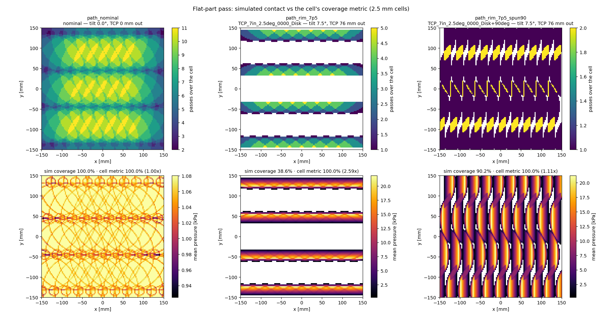
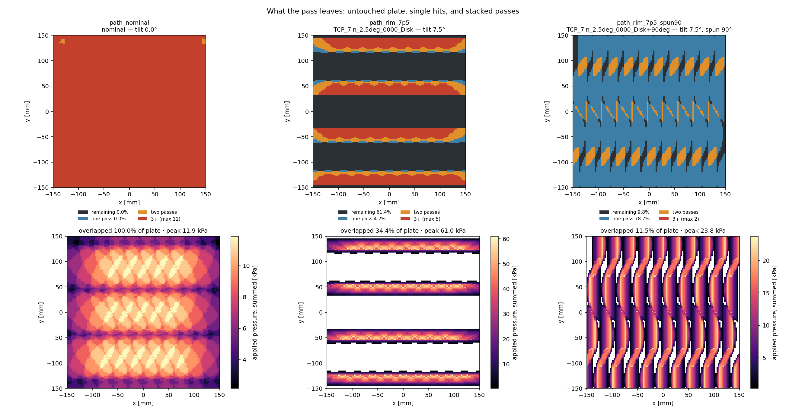
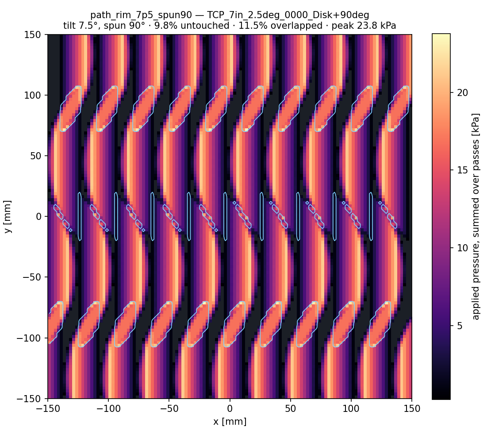

# Flat-part workflow: what the cell plans, what the contact actually is

Measured 2026-09-21. Runs under `runs/path_*` (gitignored); regenerate with the commands below.

**The result in one line:** on a flat plate at 25 N, a nominal TCP and a tilted rim TCP plan
identically and contact completely differently — the cell's coverage metric says 100% for both,
while simulated contact says 100% and **38.6%**.

## The workflow

```bash
source env.sh
# 1. plan + press a planner-shaped path (S2 part-class spacing, 300 x 300 mm plate)
python scripts/grind/press_path.py --plate 0.3 0.3 --every 4 --force 25 --record \
    --out runs/path_nominal
python scripts/grind/press_path.py --tcp-csv <settings>/tools/tcp/TCP_7in_2.5deg_0000_Disk.csv \
    --plate 0.3 0.3 --every 4 --force 25 --record --out runs/path_rim_7p5
# lead tilt: the same TCP spun a quarter turn about the tool axis
python scripts/grind/press_path.py --tcp-csv <settings>/tools/tcp/TCP_7in_2.5deg_0000_Disk.csv \
    --tcp-spin-deg 90 --plate 0.3 0.3 --every 4 --force 25 --record --out runs/path_rim_7p5_spun90
# 2. coverage + overlap maps, both metrics, and the grids behind them
python scripts/grind/path_report.py runs/path_nominal runs/path_rim_7p5 \
    runs/path_rim_7p5_spun90 --out runs/path_report
#    -> docs/figures/{coverage,overlap,heatmap_<run>}.png   (tracked)
#    -> runs/path_report/grid_<run>.npz                     (the heat map as data)
# 3. watch either pass
python scripts/replay_recording.py runs/path_rim_7p5/press.usda --loop --eye 0.5 0.5 0.4 --target 0 0 0
```

The path is generated by `grind_sim.toolpath.hatch_path`, which reproduces the planner's own
spacing: pitch `= tool_contact_width x (1 - overlap/100)` = 88.9 mm at 50% overlap on the 177.8 mm
disc, points every `pathgap_sanding_line` = 7.5 mm, and each waypoint carrying the planner triad
(`vz = -n`, `vx = direction x n`, travel `= -vy`). 41 of 123 waypoints were pressed (`--every 4`),
at ~0.2 s each.

## Result

| pass | tilt | sim coverage | cell metric | ratio | mean p | peak p | bending at tool |
|---|---|---|---|---|---|---|---|
| nominal TCP | 0° | 100.0% | 100.0% | 1.00 | 1.07 kPa | 1.09 kPa | 0 N·m |
| rim TCP, side tilt | 7.5° | **38.6%** | 100.0% | **2.59** | 10.0 kPa | 24.1 kPa | 1.89 N·m |
| rim TCP, **lead tilt** (spun 90°) | 7.5° | **90.2%** | 100.0% | 1.11 | 9.4 kPa | 24.0 kPa | 1.89 N·m |



Reading the maps:

- **Nominal**: the full 242 cm² face touches at every waypoint, cells see up to 11 passes, pressure
  is uniform at ~1 kPa. Planned pitch and real contact agree, so both metrics read 100%.
- **Rim TCP**: contact is a ~27 cm² crescent, so the pass leaves **untouched bands between the
  hatch lines**. Pressure is 10x higher where it does touch (24 kPa peak), and the spindle carries
  1.89 N·m of bending that the nominal pass does not.

## Lead tilt versus side tilt — same TCP, spun 90°

`--tcp-spin-deg 90` rotates the TCP about the tool axis, which is the cell's own `Rz(theta)` term
(the `0000`/`0300`/`0600`/`0900` clock positions). Against a path it swaps which way the disc leans
relative to travel, and it is the single biggest lever on coverage found so far:

| pass | remaining | one pass | overlapped | applied 1x | applied 2x+ | peak applied |
|---|---|---|---|---|---|---|
| nominal | 0.0% | 0.0% | 100.0% (max 11) | — | 8.4 kPa | 11.9 kPa |
| side tilt | **61.4%** | 4.2% | 34.4% (max 5) | 5.2 kPa | 30.6 kPa | **61.0 kPa** |
| lead tilt | **9.8%** | 78.7% | 11.5% (max 2) | 9.8 kPa | 13.8 kPa | 23.8 kPa |



Per-pass heat maps, one sheet each, with the overlap boundaries outlined
(`docs/figures/heatmap_<run>.png`):



- **Side tilt** (the file as calibrated) leans the disc across the direction of travel, so the
  crescent sweeps a narrow band along each hatch line. 61% of the plate is never touched, and where
  lines do overlap the applied pressure stacks to 61 kPa — five times the nominal peak. Worst of
  both: large gaps and local over-grinding.
- **Lead tilt** (the same TCP spun 90°) leans it along travel, so the crescent sweeps *across* the
  pitch as the tool advances. Coverage rises 38.6% -> **90.2%**, overlap falls to 11.5%, and peak
  applied pressure drops from 61 kPa to 24 kPa. Same force, same tilt angle, same path.
- Spindle bending is identical (1.889 N·m both ways), because the moment arm is set by the TCP
  offset, not by its clock position. The mechanical load on the tool does not tell these two apart —
  only the contact does.

Three consequences for planning:

1. **Pitch is computed from the wrong width when the TCP is tilted.** The planner spaces lines by
   the disc *diameter*; a 7.5° rim TCP contacts over roughly a quarter of it. With side tilt the
   coverage is over-estimated by 2.6x and the gaps are real; spinning the same TCP to lead tilt
   recovers most of it without changing the plan.
2. **The cell's coverage metric cannot see this.** Its cylinder never tilts and its 25 mm
   `backing_pad_height` allowance credits standoff as contact, so it reports 100% for a pass that
   touches 38.6% of the plate. That is not a bug in the metric — it measures reachability, not
   contact — but it is not a coverage guarantee either.
3. **Force alone does not describe the pass.** Same 25 N setpoint, 10x difference in contact
   pressure. Anything downstream that assumes removal tracks force (Preston's `p·v`) has to carry
   the pressure distribution, not the setpoint.

## Where the outputs live

`runs/` is gitignored, so figures written only there vanish on a fresh clone. `path_report.py`
therefore writes its figures to **`docs/figures/`** as well, and saves the heat map *as data* next
to the run:

```python
import numpy as np
grid = np.load("runs/path_report/grid_path_rim_7p5_spun90.npz")
grid["applied_pressure_pa"]   # [ny, nx] summed over passes
grid["visits"]                # pass count per cell
grid["dose_n"]                # sum of pressure x area — what a Preston model integrates
grid["cell_size_m"], grid["origin_m"], grid["plate_size_m"]
```

That way the map can be re-plotted, differenced against another pass, or fed forward without
re-running the simulation.

## What is trustworthy here, and what is not

- **Geometry and coverage: trustworthy.** They follow from the TCP frames and the disc, both of
  which are pinned against the cell's own files by `tests/test_tcp.py`.
- **Absolute pressures: provisional.** Pad stiffness is `TODO_MEASURE` (run at a foam-like
  100 kPa). The fidelity gate (`docs/gate_findings.md`) shows a hard pad pressed flat cannot be
  resolved at any affordable voxel, so these runs deliberately use a compliant pad. Ratios between
  configurations are more reliable than absolute values.
- **No pressure ground truth exists.** Platform models no contact mechanics, so coverage geometry
  is the only thing that can be cross-checked. Nothing here has been validated against hardware.
- **Two planner conventions remain unverified** and are recorded in each run's
  `summary.json > path.conventions`: whether TPP serpentines alternate rows, and
  `flipTiltDirectionToMaintainWithWorld`'s tilt-sign flip, which depends on traversal direction.

## Frame bugs this workflow flushed out

Both produced plausible-looking results before they were caught:

1. **TCP quaternions read scalar-first.** The files are `X, Y, Z, Qx, Qy, Qz, Qw`. Reading
   `w` first yields a valid rotation and a completely wrong frame.
2. **TCP +Z pointed along the surface normal**, out of the part, instead of `-normal`. Every tilted
   TCP was mirrored; the disc leaned away from its own TCP and touched 166 mm from it.

The test that catches both: a tilted disc must touch within 20 mm of its own TCP axis, because a
TCP *is* the contact point. It now touches at 15.5 mm (`0000`) and 12.7 mm (`0600`).
