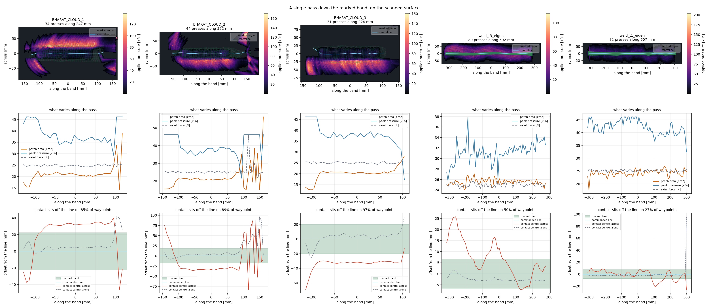

# A single pass down five real scans

Measured 2026-09-22. One pass along the centre of each green-marked region, on the scanned surface,
disc held at 25 N through `TCP_7in_2.5deg_0000_Disk` spun 90° so its leading edge rides the line.

**The result in one line:** on the three BHARAT parts the contact is not where the line is. The
disc reaches neighbouring material before the marked band, and the contact centre sits 20–34 mm
off the commanded line on 85–97% of waypoints. On the two welds, which are flat to ±1 mm across
200 mm, it tracks the line as intended.

## Result

| part | band (mm) | presses | marked hit | patch (cm²) | peak (kPa) | off-band | across offset |
|---|---|---|---|---|---|---|---|
| BHARAT_CLOUD_1 | 251 × 45 | 34 | 79.7% | 21.2 ± 4.3 | 38.7 | **85%** | +19.8 mm |
| BHARAT_CLOUD_2 | 309 × 36 | 44 | 72.3% | 22.6 ± 7.2 | 40.0 | **89%** | −9.8 mm |
| BHARAT_CLOUD_3 | 227 × 40 | 31 | 81.1% | 20.0 ± 3.2 | 37.9 | **97%** | −33.9 mm |
| weld_t3_eigen | 605 × 13 | 80 | 100.0% | 25.6 ± 0.6 | 31.2 | 50% | +6.8 mm |
| weld_t1_eigen | 620 × 15 | 82 | 99.6% | 24.2 ± 1.3 | 42.2 | 27% | −1.2 mm |

"Off-band" is the share of waypoints whose contact *centre* lies outside the painted band.
"Marked hit" stays high even there because the patch is ~20 cm² and still overlaps the band —
the band is being touched by the edge of a patch that is centred somewhere else.



Each part also has its own figure, at full size — the patch field over the marked region, what varies
along the pass, and where the contact centre sat relative to the line:

| | |
|---|---|
| [BHARAT_CLOUD_1](figures/part_BHARAT_CLOUD_1.png) | [BHARAT_CLOUD_2](figures/part_BHARAT_CLOUD_2.png) |
| [BHARAT_CLOUD_3](figures/part_BHARAT_CLOUD_3.png) | [weld_t3_eigen](figures/part_weld_t3_eigen.png) |
| [weld_t1_eigen](figures/part_weld_t1_eigen.png) | |

## Why the contact leaves the line

The disc is 178 mm across; these bands are 13–45 mm wide. Anything proud within a disc radius of
the line gets touched first. Cross-sections through the scans, at mid-band:

- **BHARAT_CLOUD_3** — material 20–40 mm to one side sits ~1.7 mm above the band, and the surface
  climbs to +11 mm by 100 mm out. The contact sits −30 to −40 mm off the line for the entire pass:
  the tool rides that shoulder and never settles onto the band.
- **BHARAT_CLOUD_1** — a 56 mm drop-off begins 60 mm to one side while the surface rises 12 mm on
  the other. Contact holds +30 to +40 mm off-line through the middle of the pass.
- **BHARAT_CLOUD_2** — offsets swing between −40 and +75 mm over the last 60 mm of the pass, where
  the band runs out onto a step.
- **weld_t3 / weld_t1** — flat to ±1 mm across 200 mm, so contact stays on the line, patch area is
  steady (±0.6 and ±1.3 cm² against ±3–7 cm² on the BHARAT parts), and the pass does what the plan
  assumes.

A millimetre of relief is enough. The tool does not need a wall to climb — a shoulder 30 mm away
and 2 mm proud takes the contact off the weld.

## What this means for planning

1. **A centreline is not a contact guarantee.** The planner positions a TCP; where the disc
   actually touches follows from the surface within a disc radius of it. On the BHARAT parts the
   commanded line and the ground region differ by more than the band width.
2. **Force telemetry will not reveal it.** Axial force holds 25 N to within 3% on every part, in
   every case, whether the contact is on the band or 34 mm off it.
3. **Patch area variability is the tell.** The welds hold 25 ± 1 cm²; the BHARAT parts swing
   15–46 cm². A pass whose patch area wanders is a pass whose contact is moving around.
4. **Peak pressure runs 31–42 kPa** on the parts against ~24 kPa on a flat plate at the same force,
   because contact concentrates on whatever is proud.

## Reproduce

```bash
source env.sh
python scripts/grind/press_part.py \
    --profile <profiles>/weld_t1_eigen \
    --tcp-csv <settings>/tools/tcp/TCP_7in_2.5deg_0000_Disk.csv --tcp-spin-deg 90 \
    --force 25 --record --out runs/part_weld_t1_eigen
python scripts/grind/part_report.py runs/part_* --out runs/part_report
```

Each part takes 9–16 s: the scan is meshed as a watertight slab (hydroelastic contact refuses open
surfaces) and the SDF is rebuilt in 150 mm chunks along the line, because one SDF covering a 600 mm
weld plus the disc's reach will not fit in GPU memory at a voxel fine enough to resolve penetration.

## Watch a pass

`press_part.py --record` writes `press.usda`, but it rebuilds the stage once per SDF chunk, so the
file it leaves behind holds only the *last* chunk's slab — the disc flies over empty space for most
of the pass. Rebake it from the saved run first (no Isaac Sim, no GPU, ~0.5 s per part):

```bash
python scripts/grind/rebake_part_usd.py runs/part_*        # prints a framed replay command per run
python scripts/replay_recording.py runs/part_BHARAT_CLOUD_3/press.usda --loop --speed 0.5 \
    --eye -0.064 -0.285 0.311 --target -0.064 -0.002 -0.034
```

The rebaked scene is the whole scanned neighbourhood as one slab, the marked region in green, the
disc at every pressed waypoint (at 40% opacity, so the patch shows through it), and the contact
patch coloured by pressure. It is baked animation, not physics, so it opens in seconds and looks
the same every time. On the BHARAT parts you can watch the patch sit beside the green band rather
than on it; on the welds it stays on the line.

To review all five without driving a camera, render them to video instead — headless, five fixed
points of view per part, a couple of seconds each:

```bash
python scripts/grind/render_views.py runs/part_* --out runs/part_videos
```

| view | what it answers |
|---|---|
| `iso` | overview — where the disc is on the part |
| `across` | square to the band, low — is the disc sitting on a shoulder beside the line? |
| `along` | down the line, low — how the lead tilt presents the disc to the surface |
| `top` | plan, disc hidden — the patch against the green band, the clearest single view |
| `chase` | tracks the disc down the pass, close in |

`top` is the one to open first: on `BHARAT_CLOUD_3` the patch sits entirely below the green band for
the whole pass, which is the 97% off-band number in the table as a picture.

## Limits specific to these runs

- **The part is a heightfield slab.** A single height per (x, y) in the band's frame represents
  steps and slopes, but **not undercuts or overhangs**. The BHARAT clouds have 56 mm drop-offs at
  the scan edge, which appear as cliffs; if the real part has material tucked under one of those,
  this mesh does not have it.
- **Ends of a pass are unreliable.** The last waypoint or two sit where the disc half-hangs off the
  scanned region, which is why the offsets swing wildly at both ends of every plot. Treat the
  interior of each pass as the result.
- **Scan noise is smoothed**, not modelled: the surface is resampled onto a 2 mm grid by median,
  and the centreline and normals are smoothed along the band.
- **Pressures remain provisional** — pad stiffness is still `TODO_MEASURE` and these run foam-soft.
  Where the contact lands is geometry and is trustworthy; how hard it presses is not yet calibrated.
